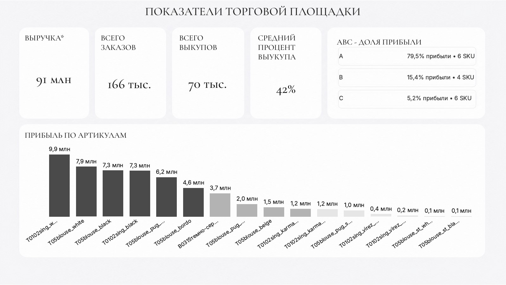
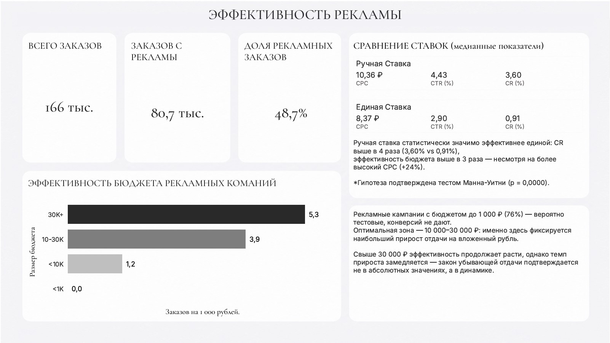
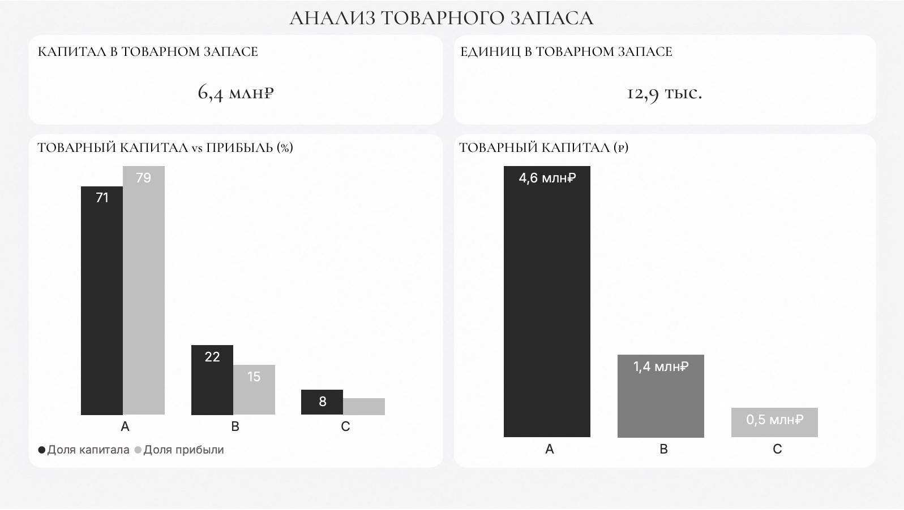

# Аналитика маркетплейса Wildberries

Полный аналитический проект на реальных данных продавца Wildberries — от сырых выгрузок до интерактивных дашбордов в Power BI.

---

## Превью дашбордов

| Обзор бизнеса | Эффективность рекламы | Анализ товарного запаса |
|---|---|---|
|  |  |  |

---

## О проекте

Анализ охватывает период **май 2025 — май 2026** и включает два товарных направления: женские блузки и видеорегистраторы. В основе — реальные данные продаж, рекламных кампаний и складских остатков.

**Ключевые вопросы, на которые отвечает проект:**
- Какие артикулы генерируют основную прибыль и как распределён товарный капитал?
- Какой тип рекламной ставки эффективнее и при каком бюджете реклама работает оптимально?
- Пропорционально ли вложен капитал в товарный запас относительно вклада каждой группы в прибыль?

---

## Стек технологий

| Инструмент | Применение |
|---|---|
| Python (pandas, scipy, matplotlib, seaborn, pingouin) | Очистка данных, анализ, проверка гипотез |
| SQL (MySQL) | Первичная очистка и трансформация данных |
| Power BI | Интерактивные дашборды |
| Jupyter Notebook | Аналитические ноутбуки |

---

## Структура репозитория

```
wildberries-analytics/
├── Data/
│   ├── Raw/                  # Исходные выгрузки из WB
│   └── Processed/            # Очищенные данные
├── Notebooks/                # Jupyter-ноутбуки с анализом
├── Dashboard/                # Файлы Power BI (.pbix)
├── Reports/                  # PDF-экспорт дашбордов
├── Preview/                  # Скриншоты дашбордов
└── SQL/                      # SQL-скрипты очистки данных
```

---

## Анализы и ноутбуки

### 01 — Проверка гипотез: реклама
`Notebooks/01_hypothesis_advertising.ipynb`

Проверено 3 гипотезы на данных 159 рекламных кампаний после дедупликации.

**Гипотеза 1 — Ручная ставка эффективнее единой:**
Подтверждена. Тест Манна-Уитни, p = 0.0000. CR выше в 4 раза (3.60% vs 0.91%), эффективность бюджета выше в 3 раза — несмотря на CPC дороже на 24%.

**Гипотеза 2 — Закон убывающей отдачи:**
Подтверждена в динамике. Оптимальная зона бюджета — 10 000–30 000 ₽, после эффективность продолжает расти, однако темп прироста замедляется — закон убывающей отдачи подтверждается не в абсолютных значениях, а в динамике.

**Гипотеза 3 — Частота показов и CR:**
Не может быть проверена. Диапазон частоты 0.86–1.0 слишком узкий для обнаружения эффекта.

---

### 02 — ABC-анализ и юнит-экономика
`Notebooks/02_abc_unit_economics.ipynb`

Анализ по 16 артикулам с известной себестоимостью (из 34). Все артикулы прибыльны.

| Группа | Артикулов | Доля прибыли |
|---|---|---|
| A | 6 | 79.5% |
| B | 4 | 15.4% |
| C | 6 | 5.2% |

---

### 03 — Анализ замороженного капитала
`Notebooks/03_frozen_capital.ipynb`

Оценка пропорциональности вложений в товарный запас относительно вклада каждой ABC-группы в прибыль.

| Группа | Заморожено, ₽ | Доля капитала | Доля прибыли |
|---|---|---|---|
| A | 4 563 450 | 70.8% | 79.5% |
| B | 1 389 950 | 21.6% | 15.4% |
| C | 494 100 | 7.7% | 5.2% |

Общий капитал в товарном запасе — **6.4 млн ₽** по 16 артикулам с известной себестоимостью.

---

## Ограничения анализа

- Себестоимость известна по 16 из 34 артикулов — юнит-экономика и анализ капитала охватывают только их
- Рекламные расходы не распределены по артикулам — нет ключей связки
- Рекламная статистика накопительная, без помесячной динамики
- Налоги в расчётах не учитываются

---

---

# Wildberries Marketplace Analytics

A full-cycle analytics project based on real Wildberries seller data — from raw exports to interactive Power BI dashboards.

---

## Dashboard Preview

| Business Overview | Advertising Efficiency | Inventory Analysis |
|---|---|---|
|  |  |  |

---

## About

The analysis covers the period **May 2025 – May 2026** across two product categories: women's blouses and dashcams. Built on real sales, advertising, and inventory data.

**Key questions addressed:**
- Which SKUs drive the most profit and how is working capital distributed across inventory?
- Which ad bid type performs better and at what budget level does advertising reach peak efficiency?
- Is capital invested in inventory proportional to each group's contribution to profit?

---

## Tech Stack

| Tool | Usage |
|---|---|
| Python (pandas, scipy, matplotlib, seaborn, pingouin) | Data cleaning, analysis, hypothesis testing |
| SQL (MySQL) | Initial data cleaning and transformation |
| Power BI | Interactive dashboards |
| Jupyter Notebook | Analytical notebooks |

---

## Repository Structure

```
wildberries-analytics/
├── Data/
│   ├── Raw/                  # Raw exports from Wildberries
│   └── Processed/            # Cleaned and enriched datasets
├── Notebooks/                # Jupyter notebooks with analysis
├── Dashboard/                # Power BI files (.pbix)
├── Reports/                  # PDF dashboard exports
├── Preview/                  # Dashboard screenshots
└── SQL/                      # SQL cleaning scripts
```

---

## Analysis & Notebooks

### 01 — Hypothesis Testing: Advertising
`Notebooks/01_hypothesis_advertising.ipynb`

3 hypotheses tested on 159 deduplicated advertising campaigns.

**Hypothesis 1 — Manual bid outperforms unified bid:**
Confirmed. Mann-Whitney U test, p = 0.0000. CR is 4× higher (3.60% vs 0.91%), budget efficiency is 3× higher — despite CPC being 24% more expensive.

**Hypothesis 2 — Diminishing returns:**
Confirmed in growth rate dynamics. Optimal budget zone: 10,000–30,000 ₽. Beyond this threshold, efficiency continues to grow but the rate of increase decelerates significantly.

**Hypothesis 3 — Impression frequency and CR:**
Cannot be tested. Frequency range of 0.86–1.0 is too narrow to detect any effect.

---

### 02 — ABC Analysis & Unit Economics
`Notebooks/02_abc_unit_economics.ipynb`

AAnalysis across 16 SKUs with known cost price (out of 34 total). All SKUs are profitable.

| Group | SKUs | Profit Share |
|---|---|---|
| A | 6 | 79.5% |
| B | 4 | 15.4% |
| C | 6 | 5.2% |

---

### 03 — Frozen Capital Analysis
`Notebooks/03_frozen_capital.ipynb`

Assessment of whether capital invested in inventory is proportional to each ABC group's contribution to profit.

| Group | Frozen Capital, ₽ | Capital Share | Profit Share |
|---|---|---|---|
| A | 4,563,450 | 70.8% | 79.5% |
| B | 1,389,950 | 21.6% | 15.4% |
| C | 494,100 | 7.7% | 5.2% |

Total capital in inventory — **6.4M ₽** across 16 SKUs with known cost price.

---

## Limitations

- Cost price is available for 16 out of 34 SKUs — unit economics and capital analysis cover these only
- Ad spend is not allocated at SKU level — no linkage key available
- Ad statistics are cumulative with no monthly breakdown
- Taxes are not factored into calculations
